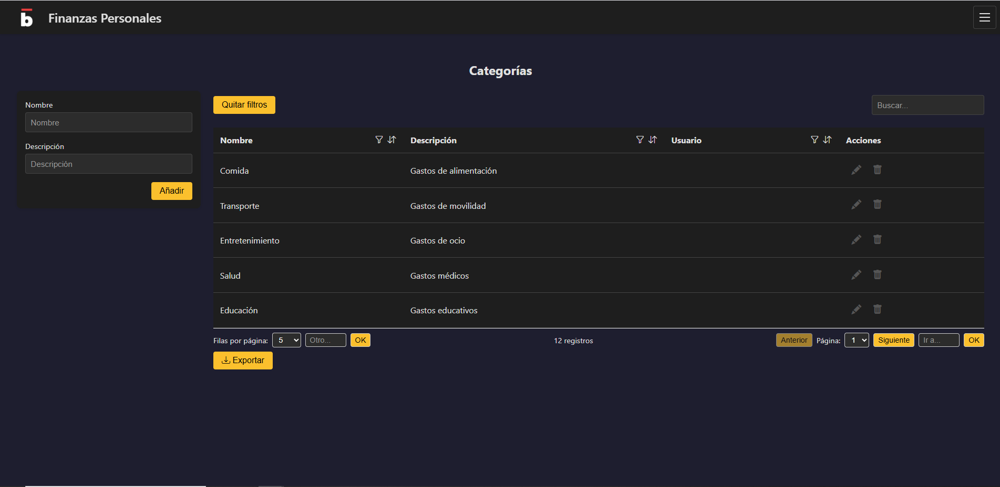
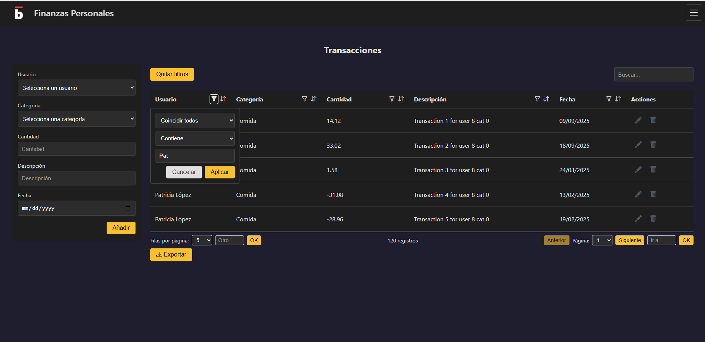
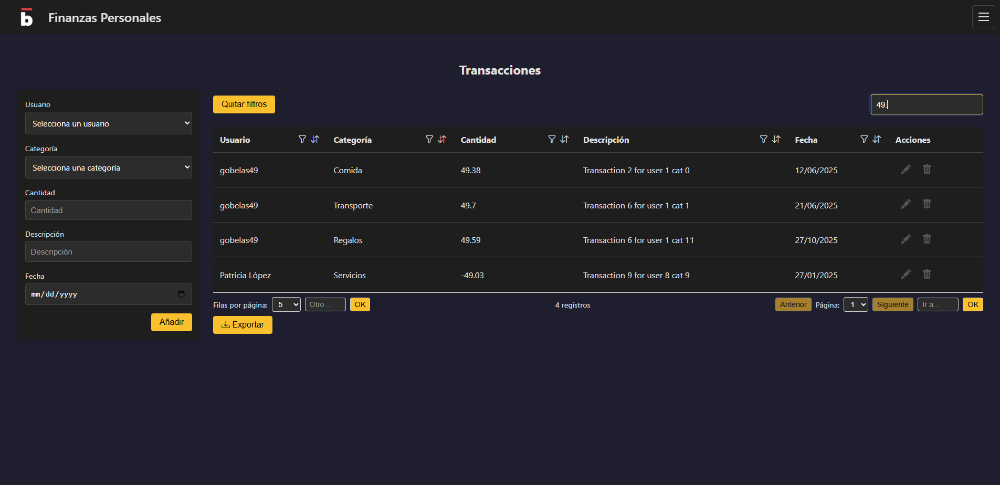
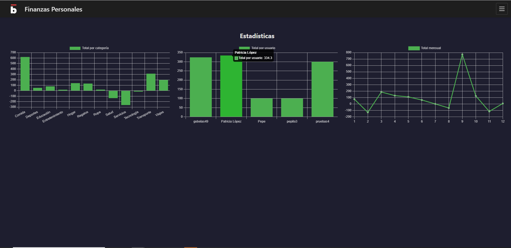
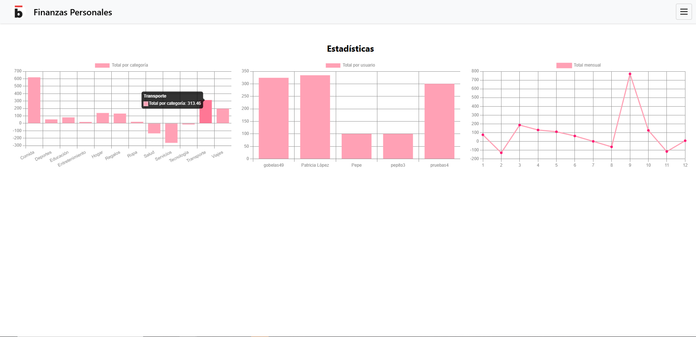

# Finanzas Personales  

Proyecto de aplicación de finanzas personales usando FastAPI + Angular.  

## Stack Tecnológico  


## Requisitos  
- Python 3.10+  
- FastAPI  
- Node.js >= 18  
- Angular CLI  


## Desarrollo  
### Backend  
```bash
cd backend
pip install -r requirements.txt
uvicorn app.main:app --reload
```

La API se expone en http://localhost:8000  

### Frontend  
```bash
cd frontend/finanzas-app
npm install
ng serve
```

Acceder en http://localhost:4200  


## Roadmap de desarrollo  

### Fase 1: Backend y CRUD básico  
- Configuración de entorno Python + virtualenv  
- FastAPI: endpoints CRUD para usuarios, categorías y transacciones  
- Conexión a MongoDB  
- Testing básico  

### Fase 2: Dashboard y análisis  
- Endpoints para estadísticas y agregados  
- Angular: listado de transacciones, filtros, gráficos  

### Fase 3: Funcionalidades adicionales  
- Exportación a CSV/Excel  
- Notificaciones o alertas (Celery opcional)  
- Mejoras de UX/UI  

### Fase 4: Opcional  
- Multiusuario y compartición de datos  
- Integración con app móvil  


## 🗂 Estructura de carpetas  
finanzas_personales/  
│  
├─ backend/  
│   ├─ app/  
│   │   ├─ main.py              # Punto de entrada FastAPI  
│   │   ├─ models.py            # Modelos de MongoDB (Motor)  
│   │   ├─ schemas.py           # Pydantic schemas (validación/serialización)  
│   │   ├─ crud.py              # Funciones CRUD para usuarios, transacciones, categorías  
│   │   ├─ api/  
│   │   │   ├─ users.py         # Endpoints de usuarios  
│   │   │   ├─ transactions.py  # Endpoints de transacciones  
│   │   │   └─ categories.py    # Endpoints de categorías  
│   │   └─ config.py            # Configuración (DB URI, JWT, etc.)  
│   │  
│   ├─ tests/                   # Tests de endpoints y modelos  
│   └─ requirements.txt         # Dependencias Python  
│  
├─ frontend/  
│   └─ finanzas-app/  
│       ├── README.md  
│       ├── angular.json  
│       ├── package-lock.json  
│       ├── package.json  
│       ├── public  
│       │   └── favicon.ico  
│       ├── src  
│       │   ├── app  
│       │   │   ├── app.component.css  
│       │   │   ├── app.component.html  
│       │   │   ├── app.component.spec.ts  
│       │   │   ├── app.component.ts  
│       │   │   ├── app.config.ts  
│       │   │   ├── app.routes.ts  #Define las rutas y redirecciones  
│       │   │   ├── core  
│       │   │   │   ├── models     #Tipos TypeScript de las entidades  
│       │   │   │   └── services   #Servicios que llaman al backend FastAPI  
│       │   │   └── pages          #Componentes UI de cada entidad.  
│       │   │       ├── categories  
│       │   │       ├── transactions  
│       │   │       └── users  
│       │   ├── index.html  
│       │   ├── main.ts  
│       │   └── styles.scss  
│       ├── tsconfig.app.json  
│       ├── tsconfig.json  
│       └── tsconfig.spec.json  
│  
├─ .env  
├─ README.md  
└─ .gitignore  


## 📄 Licencia  
MIT License - ver LICENSE para más detalles.  


## 📸 Capturas de pantalla  

<table>
  <tr>
    <td align="center" width="33%">
      <strong>Integración en otras aplicaciones </strong><br>
      <br>      
    </td>
    <td align="center" width="33%">
      <strong>Componente Categorías</strong><br>
      <br>      
    </td>
    <td align="center" width="33%">
      <strong>Componente Transacciones</strong><br>
      <br>      
    </td>
  </tr>
  <tr style="background-color: #f6f8fa">
    <td align="center" width="33%">
      <strong>Detalle filtros, búsqueca, paginación, export, ... </strong><br>
      <br>      
    </td>
    <td align="center" width="33%">
      <strong>Dashboard gráficas</strong><br>
      <br>      
    </td>
    <td align="center" width="33%">
      <strong>Tema claro/oscuro</strong><br>
      <br>      
    </td>
  </tr>
</table>